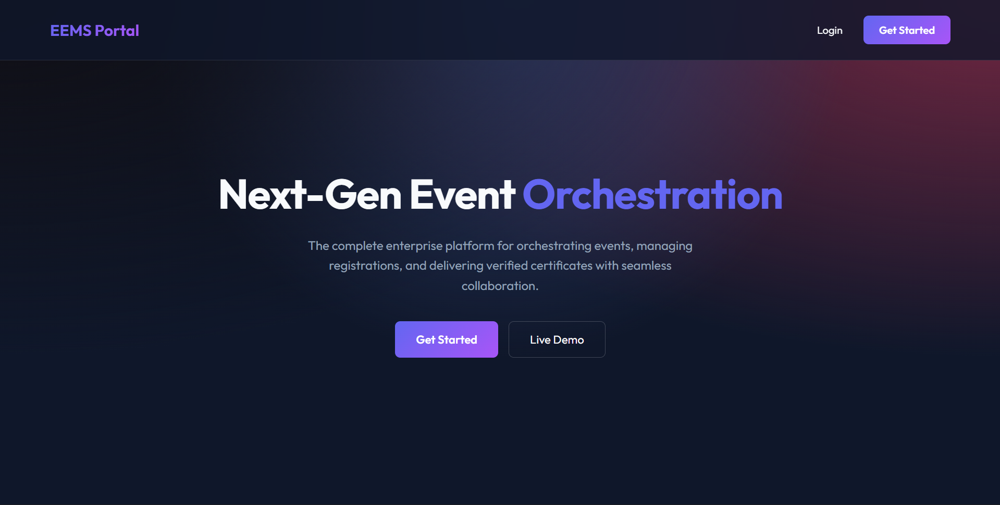
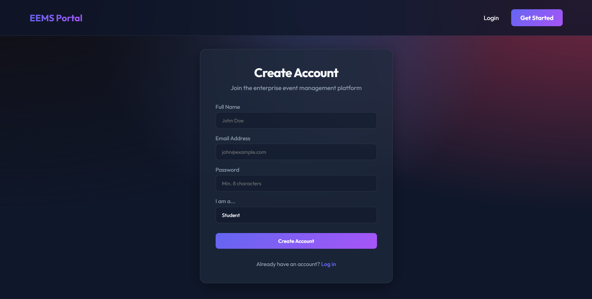
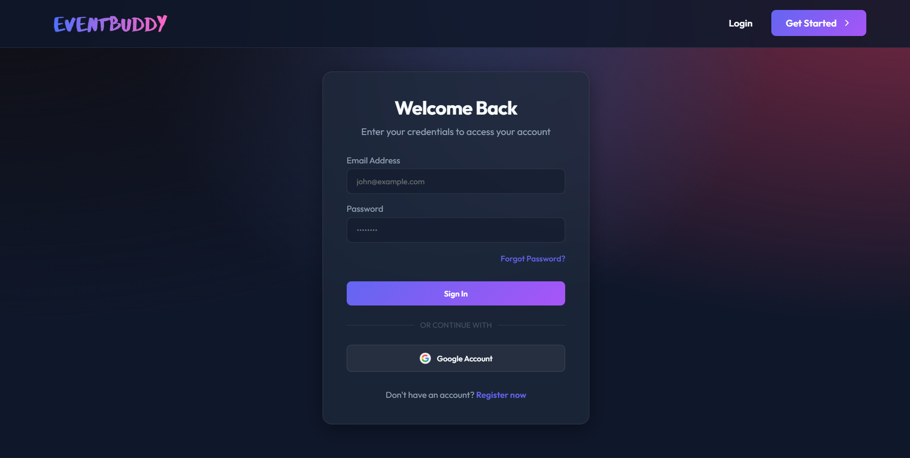
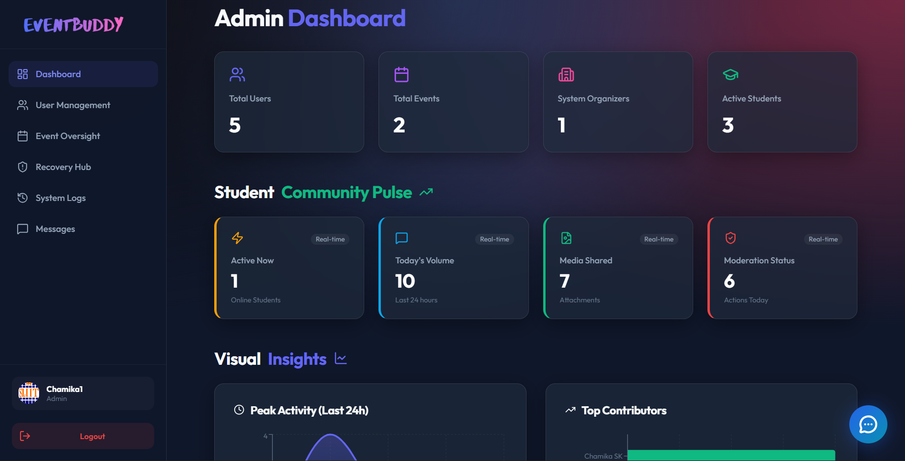
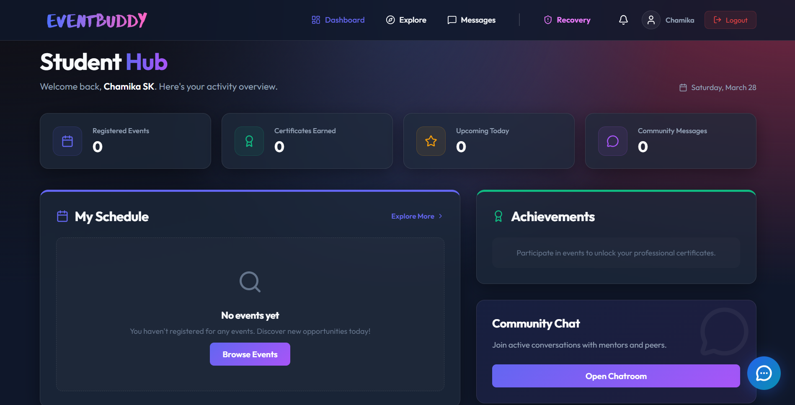

# Enterprise Event Management System (EEMS) – User Management Module

## Project Overview
The **Enterprise Event Management System (EEMS)** is a robust platform designed to facilitate the orchestration of corporate events, user registrations, and certificate issuance. The **User and Event Management Module** serves as the core foundation of the system, providing secure authentication, role-based access control, and comprehensive management for students, organizers, and administrators.

In any enterprise-grade platform, user management is critical for ensuring data integrity, security, and a personalized user experience. This module handles everything from initial registration to advanced administrative oversight.

### System Interface Gallery

| Landing Page |
| :---: |
|  |

| Registration Profile | Secure User Login |
| :---: | :---: |
|  |  |

| Administrative Dashboard | Student User Dashboard |
| :---: | :---: |
|  |  |

---

## Features

### User Features
*   **Secure Authentication**: JWT-based sign-up and login flow.
*   **Multi-Factor Authentication (MFA)**: Support for TOTP-based 2FA (Google Authenticator) for enhanced account security.
*   **Google OAuth Integration**: Seamless one-click login via Google accounts.
*   **Profile Management**: Dedicated profile page to view and update personal information (name, phone, avatar).
*   **In-App Notification Hub**: Real-time dropdown bell alerting users of new events and upcoming 24-hr reminders, featuring 5-second asynchronous polling and instant Mark-as-Read controls.
*   **Event Exploration**: Visual, searchable event discovery and registration with beautiful poster image banners.
*   **Smart Recovery Hub**: A global timeline for reporting lost or found items, complete with categorical filtering, text search, and a "My Reports" tab.
*   **Smart Match Engine**: Automatically detects when a newly reported "Found" item matches the category of a previously "Lost" item, instantly broadcasting an In-App Notification alert to the original owner.
*   **Account Discovery**: Real-time password strength meter and account activity logs.
*   **Account Deletion**: Secure account closure with data persistence cleanup.
*   **Role-Based Access**: Specialized dashboards for Students, Organizers, and Admins.

### Admin & Organizer Features
*   **Administrative Dashboard**: High-level system monitoring with real-time statistics on users and events.
*   **Advanced User Directory**: Dynamic management table with real-time search, role-based filtering, and vivid profile picture rendering.
*   **Automated Event Reminders**: Background Cron Job system automatically dispatches email and in-app alerts to users 24 hours prior to their registered events.
*   **Event Oversight (Admin)**: Platform-wide visibility and moderation of all scheduled events.
*   **Event Orchestration (Organizer)**: Create, manage, edit, and monitor events, complete with automated file upload handling for gorgeous Event Posters.
*   **Recovery Hub Moderation**: A powerful Admin-exclusive Dashboard table featuring real-time searching (by item, category, or reporter), layered filtering, and remote Resolution override buttons.
*   **System Statistics**: Instant visibility into total users, student counts, organizer activity, and event volume.

### Security Features
*   **Advanced Protection**: Integrated account lockout mechanism after 5 failed login attempts.
*   **Multi-Factor Auth (MFA)**: Optional but highly recommended 2FA setup in the user profile.
*   **Session Management**: Real-time tracking of active login sessions with the ability to revoke specific devices or "Log out of all devices."
*   **Password Hashing**: Industry-standard encryption using `bcryptjs`.
*   **Verified Accounts**: Mandatory email verification workflow to ensure valid user identities.
*   **Unified Validation**: Comprehensive `express-validator` middleware enforcing data integrity on every POST/PUT request.

### UI/UX Excellence
*   **Skeleton Loaders**: Shimmering animated placeholders used site-wide during data fetching for a premium feel.
*   **Real-time Validation**: Instant frontend feedback for form fields (e.g., password complexity, email format, capacity checks).
*   **Interactive Design**: Dynamic glassmorphism UI with smooth transitions and hover effects.

---

## Technology Stack

### Frontend
*   **React.js**: (Vite-based) for a fast, component-based user interface.
*   **Context API**: For global authentication and user state management.
*   **Axios**: For high-performance asynchronous API communication.
*   **React Router**: For client-side routing and protected navigation paths.

### Backend
*   **Node.js & Express.js**: Providing a scalable RESTful API architecture.
*   **Node-Cron & Nodemailer**: Intelligent task scheduler and emailers powering the automated 24-hour event reminder system.
*   **Express-Validator**: For robust, centralized input validation.
*   **Multer**: Handling complex multipart/form-data uploads securely for Event Posters and avatars.
*   **Passport.js**: Integrated for Google OAuth 2.0 strategy.
*   **Speakeasy & QRCode**: Powering the MFA (Multi-Factor Authentication) system.
*   **UA-Parser-JS**: For identifying device and browser info in session management.

### Database & Authentication
*   **MongoDB**: NoSQL database for flexible and scalable data storage.
*   **Mongoose**: ODM for schema-based data validation and relationships.
*   **JWT (JSON Web Tokens)**: For secure, stateless identity transmission.
*   **Bcrypt.js**: For secure salted password hashing.

---

## System Architecture

The system follows a classic **MERN** architecture pattern with an emphasis on security:
1.  **Frontend (React)**: Communicates with the backend via REST API calls. Uses a `ProtectedRoute` component to handle role verification and MFA checks.
2.  **Backend (Express)**: Handles requests using modular controllers and routes.
3.  **Middleware Layer**: Interacts with every request to verify JWT tokens (`authMiddleware`), validate inputs (`validationMiddleware`), and check user permissions (`roleMiddleware`).
4.  **Security Layer**: Manages session state, login rate limiting, and MFA verification.
5.  **Database (MongoDB)**: Stores persistent user data, event records, and session information.

---

## Project Folder Structure

```
EEMS-ITPM/
├── backend/            # Express Server
│   ├── config/         # DB and Passport configurations
│   ├── controllers/    # Request handlers (auth, user, admin, event)
│   ├── middleware/     # Auth, Role, Validation, and Upload guards
│   ├── models/         # Mongoose schemas (User, Event, Certificate, Booking)
│   ├── routes/         # API endpoints
│   ├── utils/          # Token generation, Emailing, and helpers
│   └── server.js       # Application entry point
├── frontend/           # React App (Vite)
│   ├── src/
│   │   ├── components/ # Reusable UI (Skeleton, Password Meter, etc.)
│   │   ├── context/    # Global State (AuthContext)
│   │   ├── pages/      # View components (Login, Profile, Admin, Dashboards)
│   │   ├── services/   # API abstraction layer
│   │   └── App.jsx     # Main routing and navigation
└── package.json        # Root scripts for concurrent execution
```

---

## Database Design

The **User Schema** in MongoDB includes:
*   `name`: (String) Full name of the user.
*   `email`: (String) Unique identifier for login.
*   `isVerified`: (Boolean) Status of email verification.
*   `password`: (String) Hashed credentials.
*   `mfaEnabled`: (Boolean) Whether 2-step verification is active.
*   `role`: (Enum) `student`, `organizer`, or `admin`.
*   `sessions`: (Array) List of current active login devices with UA details.
*   `lastLogin`: (Date) Timestamp of the most recent successful login.
*   `loginAttempts`: (Number) Counter for security lockout.
*   `registeredEvents`: (Array) List of event IDs user is attending.

---

## API Endpoints (Highlights)

### Authentication & Identification
*   `POST /api/auth/register`: Create a new user account (sends verification email).
*   `POST /api/auth/login`: Authenticate and receive a JWT (handles MFA if enabled).
*   `GET /api/auth/verify-email/:token`: Confirm user identity.
*   `POST /api/auth/generate-mfa`: Setup 2FA with QR code.
*   `GET /api/auth/sessions`: View all active login devices.

### Administrative Control
*   `GET /api/admin/users`: List all system users (Admin only).
*   `GET /api/admin/stats`: Fetch real-time system-wide metrics.
*   `GET /api/admin/events`: Oversee all enterprise events.

### Event Management
*   `POST /api/events`: Create a new corporate event (Organizer only).
*   `PUT /api/events/:id`: Edit event details with date/capacity validation.
*   `POST /api/events/:id/register`: Register a student for an event with capacity checks.

### Smart Lost & Found Hub
*   `POST /api/lost-found`: Submit a new item report (automatically triggers the Smart Match Engine and notifies Admins).
*   `GET /api/lost-found`: Fetch the asynchronous feed of active and resolved items.
*   `PUT /api/lost-found/:id/resolve`: Mark an item as successfully returned (restricted to the Owner and Admins).

---

## Installation Guide

1.  **Clone Repository**: 
    ```bash
    git clone https://github.com/ChamikaShashipriya99/Enterprises-Event-Management-System-ITPM-Group-Project.git
    cd Enterprises-Event-Management-System-ITPM-Group-Project
    ```
2.  **Install Dependencies**: 
    Installs both root, backend, and frontend dependencies.
    ```bash
    npm install
    cd backend && npm install
    cd ../frontend && npm install
    ```
3.  **Setup Environment Variables**: 
    Create a `.env` file in the `backend/` directory.
4.  **Database Setup**: 
    Ensure you have a MongoDB instance running (Local or MongoDB Atlas).
5.  **Run Application**: 
    Start both frontend and backend concurrently from the root:
    ```bash
    npm run dev
    ```

---

## Environment Variables

The backend requires the following variables in the `.env` file:
*   `MONGO_URI`: Your MongoDB connection string.
*   `JWT_SECRET`: A secure random string for token signing.
*   `PORT`: Port for the backend server (default: 5000).
*   `GOOGLE_CLIENT_ID`: Your Google Cloud Console Client ID.
*   `GOOGLE_CLIENT_SECRET`: Your Google Cloud Console Client Secret.
*   `FRONTEND_URL`: The URL of your running frontend application (e.g., http://localhost:5173).

---

## Security Best Practices
*   **Bcrypt Hashing**: Passwords are never stored in plain text.
*   **JWT Integrity**: All sensitive routes are guarded by token validation.
*   **RBAC Enforcement**: Specific actions (like user deletion) are restricted to the Administrative role.
*   **Sanitized Responses**: Sensitive data like passwords are excluded from API responses.

---

## Contributors
*   **Chamika Shashipriya (IT23257054)**
