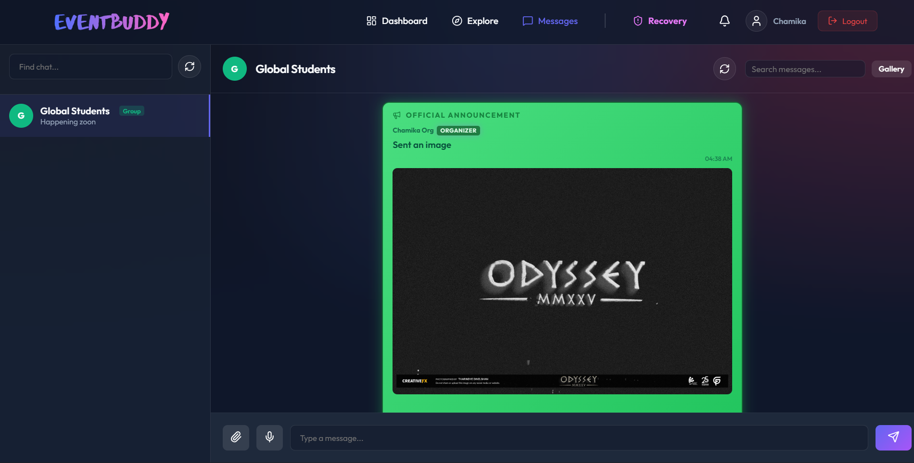
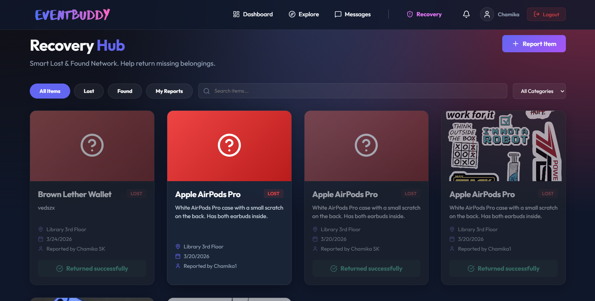
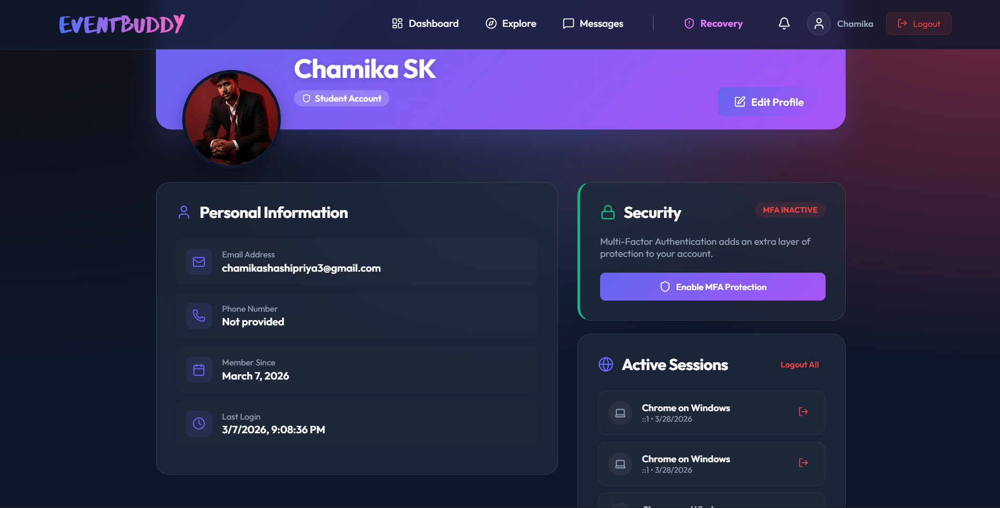

# Enterprise Event Management System (EEMS)

## Project Overview
The **Enterprise Event Management System (EEMS)** is a robust, full-stack platform designed to facilitate the rapid orchestration of corporate and university events. From user registrations and dynamic ticket generation, to smart chatting and volunteer administration, EEMS offers an all-in-one suite. 

The system provides intelligent authentication, role-based access control, and comprehensive management dashboards for Students, Organizers, and Administrators.

In any enterprise-grade platform, managing the entire ecosystem seamlessly is critical. This suite handles everything from initial event staging and ticketing to advanced administrative oversight and vendor supply.

### System Interface Gallery

| Landing Page |
| :---: |
|  |

| Registration Profile | Secure User Login |
| :---: | :---: |
|  |  |

| Administrative Dashboard | Student User Dashboard |
| :---: | :---: |
|  |  |

| Global Chat Interface | Lost & Found Hub |
| :---: | :---: |
|  |  |

| User Profile Management | 
| :---: | 
|  | 

---

## Features

### User & Identity Management
*   **Secure Authentication**: JWT-based sign-up and login flow.
*   **Multi-Factor Authentication (MFA)**: Support for TOTP-based 2FA (Google Authenticator) for enhanced account security.
*   **Google OAuth Integration**: Seamless one-click login via Google accounts.
*   **Profile Management**: Dedicated profile page to view and update personal information (name, phone, avatar).
*   **Account Discovery**: Real-time password strength meter and account activity logs.
*   **Account Deletion**: Secure account closure with data persistence cleanup.
*   **Role-Based Access**: Specialized dashboards tailored for Students, Organizers, and Admins.

### Event & Booking Platform
*   **Rich Event Exploration**: Visual, searchable event discovery and registration with beautiful poster image banners.
*   **Automated Event Reminders**: Background Cron Job system automatically dispatches email and in-app alerts to users 24 hours prior to their registered events.
*   **Event Orchestration (Organizer)**: Create, manage, edit, and monitor events with automated file upload handling.
*   **Digital Ticketing & QR Check-ins**: Generates unique QR codes upon booking. Organizers/Admins can scan to check in attendees.
*   **Gamified Loyalty System**: Attendees earn points per check-in, unlocking Bronze, Silver, and Gold user tiers.
*   **Automated Certificates**: Instantly generates beautiful event completion certificates once attendance is verified.

### Volunteer & Vendor Management
*   **Volunteer Administration**: Dedicated portal where users can register as volunteers; Admins/Organizers can efficiently deploy them to different events.
*   **Vendor Coordination**: Manage third-party service providers (catering, tech, logistics) across different events for centralized oversight.

### Smart Operations & Auditing
*   **Smart Recovery Hub (Lost & Found)**: A global timeline for reporting lost or found items, complete with categorical filtering, text search, and a "My Reports" tab.
*   **Smart Match Engine**: Automatically detects when a newly reported "Found" item matches the category of a previously "Lost" item, instantly broadcasting an In-App Notification alert to the original owner.
*   **In-App Notification Hub**: Real-time dropdown bell alerting users of new events, reminders, and match alerts featuring instant Mark-as-Read controls.
*   **Compliance Audit Trails**: Silent backend logging of critical user and administrative actions, tracked in a specialized audit log view for admins.
*   **System Statistics**: Instant visibility into total users, student counts, organizer activity, event volume, and booking statuses on dashboards.

### Communication Features
*   **Enterprise Chat Engine**: Real-time, socket-powered messaging system for instant collaboration.
*   **Global & Private Channels**: Access to a universal "Global Students" chat or start encrypted 1-on-1 conversations with any user.
*   **Multimedia Messaging**: Full support for transparent file uploads, image sharing (with gallery preview), and instant Voice Notes.
*   **Advanced UI Interactions**: Features real-time typing indicators, read receipts, emoji reactions, and message editing/deletion.
*   **Smart Mentions**: User '@mention' system to alert specific participants within a conversation.
*   **Chat Moderation**: Admins and Organizers can broadcast priority announcements, clear chat histories, and remove inappropriate content with "Deleted by Admin" audit trails.

### Security Enhancements
*   **Advanced Protection**: Integrated account lockout mechanism after 5 failed login attempts.
*   **Session Management**: Real-time tracking of active login sessions with device/browser breakdown; support for revoking specific devices or "Log out of all devices."
*   **Password Hashing**: Industry-standard encryption using `bcryptjs`.
*   **Unified Validation**: Comprehensive `express-validator` middleware enforcing data integrity on every POST/PUT request.

### UI/UX Excellence
*   **Skeleton Loaders**: Shimmering animated placeholders used site-wide during data fetching.
*   **Real-time Validation**: Instant frontend feedback for form fields (e.g., password complexity, email format, capacity checks).
*   **Interactive Design**: Dynamic glassmorphism UI with smooth transitions, modern typography, and hover effects.

---

## Technology Stack

### Frontend
*   **React.js**: (Vite-based) for a fast, component-based user interface.
*   **Context API**: For global authentication and user state management.
*   **Axios**: For high-performance asynchronous API communication.
*   **React Router**: For client-side routing and protected navigation paths.

### Backend
*   **Node.js & Express.js**: Providing a scalable RESTful API architecture.
*   **Node-Cron & Nodemailer**: Intelligent task scheduler and emailers powering the automated 24-hour event reminder system.
*   **Express-Validator**: For robust, centralized input validation.
*   **Multer**: Handling complex multipart/form-data uploads securely.
*   **Passport.js**: Integrated for Google OAuth 2.0 strategy.
*   **Speakeasy & QRCode**: Powering the MFA (Multi-Factor Authentication) system.
*   **UA-Parser-JS**: For identifying device and browser info in session management.
*   **Socket.io**: Enabling the low-latency, bi-directional communication engine for real-time chat and notifications.

### Database & Authentication
*   **MongoDB**: NoSQL database for flexible and scalable data storage.
*   **Mongoose**: ODM for schema-based data validation and relationships.
*   **JWT (JSON Web Tokens)**: For secure, stateless identity transmission.
*   **Bcrypt.js**: For secure salted password hashing.

---

## System Architecture

The system follows a classic **MERN** architecture pattern with an emphasis on security:
1.  **Frontend (React)**: Communicates with the backend via REST API calls. Uses a `ProtectedRoute` component to handle role verification and MFA checks.
2.  **Backend (Express)**: Handles requests using modular controllers and routes.
3.  **Middleware Layer**: Interacts with every request to verify JWT tokens (`authMiddleware`), validate inputs (`validationMiddleware`), and check user permissions (`roleMiddleware`).
4.  **Security Layer**: Manages session state, login rate limiting, and MFA verification.
5.  **Database (MongoDB)**: Stores persistent user data, event records, and session information.

---

## Project Folder Structure

```
EEMS-ITPM/
├── backend/            # Express Server
│   ├── config/         # DB and Passport configurations
│   ├── controllers/    # Request handlers (auth, user, admin, event, vendor, etc.)
│   ├── middleware/     # Auth, Role, Validation, and Upload guards
│   ├── models/         # Mongoose schemas (User, Event, Booking, Vendor, AuditLog, etc.)
│   ├── routes/         # API endpoints
│   ├── utils/          # Token generation, Emailing, and helpers
│   └── server.js       # Application entry point
├── frontend/           # React App (Vite)
│   ├── src/
│   │   ├── components/ # Reusable UI (Skeleton, Password Meter, etc.)
│   │   ├── context/    # Global State (AuthContext)
│   │   ├── pages/      # View components (Login, AdminEvents, VendorManagement, etc.)
│   │   ├── services/   # API abstraction layer
│   │   └── App.jsx     # Main routing and navigation
└── package.json        # Root scripts for concurrent execution
```

---

## Database Design

The **Database Schemas** in MongoDB include among others:
*   **User Schema**: Stores `name`, `email`, `role`, `mfaEnabled`, `sessions`, and security lockout counters.
*   **Event Schema**: Handles `title`, `date`, `location`, `capacity`, `vendor` relations, and visual identifiers.
*   **Booking Schema**: Links `student` and `event` with `status`, `qrCode`, and check-in times.
*   **Message/Chat Schema**: Manages real-time conversations, file attachments, and broadcast flags.
*   **LostItem Schema**: Tracks reported items, smart match status, and resolution states.
*   **Vendor Schema**: Details name, service type, contact, and system status mapping.
*   **VolunteerRegistration Schema**: Dedicated model storing volunteer sign-ups, event availability, and assignments.
*   **AuditLog Schema**: Captures administrative and operational footprint details.
*   **Certificate Schema**: Generates and stores the linkage between an event, student, and their completion certificate.

---

## API Endpoints (Highlights)

### Authentication & Identification
*   `POST /api/auth/register`: Create a new user account (sends verification email).
*   `POST /api/auth/login`: Authenticate and receive a JWT (handles MFA if enabled).

### Event & Bookings
*   `GET /api/events`: Oversee all enterprise events.
*   `POST /api/events/:id/register`: Register a student for an event with capacity checks.
*   `POST /api/bookings/:id/checkin`: Scan and check in a student verifying their QR payload.
*   `GET /api/points/my-points`: Retrieve a student's gamified hierarchy and historical checkins.

### Vendor & Volunteer Management
*   `POST /api/vendors`: Register new third-party event vendors.
*   `POST /api/volunteers`: Record a new student volunteer registration.
*   `GET /api/admin/volunteers`: Administrative grid viewing all registered volunteers.

### Smart Lost & Found Hub
*   `POST /api/lost-found`: Submit a new item report (triggers Smart Match Engine).
*   `PUT /api/lost-found/:id/resolve`: Mark an item as successfully returned.

### Enterprise Messaging
*   `POST /api/chat`: Access or create a new 1-on-1 chat.
*   `POST /api/chat/message`: Dispatch a new message with Socket.io broadcasting.
*   `POST /api/chat/upload`: Secure endpoint for uploading chat media and voice notes.

---

## Installation Guide

1.  **Clone Repository**: 
    ```bash
    git clone https://github.com/ChamikaShashipriya99/Enterprises-Event-Management-System-ITPM-Group-Project.git
    cd Enterprises-Event-Management-System-ITPM-Group-Project
    ```
2.  **Install Dependencies**: 
    Installs both root, backend, and frontend dependencies.
    ```bash
    npm install
    cd backend && npm install
    cd ../frontend && npm install
    ```
3.  **Setup Environment Variables**: 
    Create a `.env` file in the `backend/` directory.
4.  **Database Setup**: 
    Ensure you have a MongoDB instance running (Local or MongoDB Atlas).
5.  **Run Application**: 
    Start both frontend and backend concurrently from the root:
    ```bash
    npm run dev
    ```

---

## Environment Variables

The backend requires the following variables in the `.env` file:
*   `MONGO_URI`: Your MongoDB connection string.
*   `JWT_SECRET`: A secure random string for token signing.
*   `PORT`: Port for the backend server (default: 5000).
*   `GOOGLE_CLIENT_ID`: Your Google Cloud Console Client ID.
*   `GOOGLE_CLIENT_SECRET`: Your Google Cloud Console Client Secret.
*   `FRONTEND_URL`: The URL of your running frontend application (e.g., http://localhost:5173).

---

## Security Best Practices
*   **Bcrypt Hashing**: Passwords are never stored in plain text.
*   **JWT Integrity**: All sensitive routes are guarded by token validation.
*   **RBAC Enforcement**: Specific actions (like user deletion) are restricted to the Administrative role.
*   **Sanitized Responses**: Sensitive data like passwords are excluded from API responses.

---

## Team Contributions

This platform was developed collaboratively by our team, with each member taking ownership of specific standard and special features:

### MEMBER 1 – KUMARATHUNGA R C S
**Standard Features:**
*   **User Authentication and Profile Management**
*   **Automated Notification System (Reminders)**
*   **Admin & Organizer Dashboard**

**Special Feature: Smart Lost & Found Recovery Hub**
The Lost & Found System lets people report lost or found items by adding details like the item type, event location, description, and an optional photo. The system shows all reports in a searchable feed and sends alerts when there’s a possible match. This helps people quickly recover their belongings and makes it easier for event staff to manage lost items.

### MEMBER 2 – PRIYAWANTHA M G C
**Standard Feature: Third Party Vendor Coordinator & Services**
Manages external vendors such as equipment, and media services etc. Organizers can assign vendors, track service status, and manage event-related resources efficiently.

**Special Feature: Event Credit Point System**
The Event Credit Point System rewards students with points for attending events. Points contribute to achievement levels like Bronze, Silver, or Gold, motivating consistent participation and engagement in various activities.

### MEMBER 3 – INDUWARI M A A
**Standard Feature: Booking Reservation Engine**
Allows students to book or reserve seats for events. The system checks availability, prevents double-booking, and provides a booking confirmation with a unique booking ID.

**Special Feature: Intelligent Attendee Check-In & Digital Certification**
Uses QR codes for contactless check-in and automatically records attendance. After the event, the system generates a digital certificate in PDF format for students to download or receive via email.

### MEMBER 4 – NEELANGA U H P
**Standard Feature: Event Discovery And Browsing**
Users can search and filter events by name, date, or category such as workshops, sports, and career fairs. The system displays a dynamic event catalog with real-time updates, including posters, descriptions, and registration deadlines. It also shows status indicators like "Booking Open", "Sold Out", or "Closed" to clearly inform users about event availability.

**Special Feature: "Flash-Volunteer" Matching & Coordination**
Enables organizers to quickly find and assign volunteers during urgent situations. The system matches volunteers based on skills and availability. Volunteers receive task details and reporting time, ensuring smooth coordination and efficient event management.

### UNIQUE FEATURE
**Live Event Engagement & Instant Feedback Engine**
The Live Event Engagement & Instant Feedback Engine allows attendees to interact during events through live Q&A sessions, polls, and instant session ratings. Participants can submit questions, respond to polls, and give star ratings in real time. The system displays live results through charts or word clouds for presenters and generates a post-event sentiment report for organizers. This increases student engagement during seminars or fests and provides valuable insights to improve future events.
